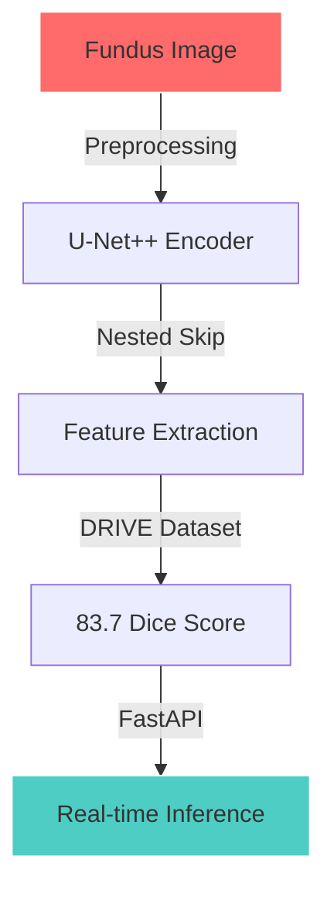

<div align="center">

<pre>
 ██████╗  █████╗ ██╗   ██╗██████╗  █████╗ ██╗   ██╗    ██████╗  █████╗ ████████╗██╗██╗     
██╔════╝ ██╔══██╗██║   ██║██╔══██╗██╔══██╗██║   ██║    ██╔══██╗██╔══██╗╚══██╔══╝██║██║     
██║  ███╗███████║██║   ██║██████╔╝███████║██║   ██║    ██████╔╝███████║   ██║   ██║██║     
██║   ██║██╔══██║██║   ██║██╔══██╗██╔══██║╚██╗ ██╔╝    ██╔═══╝ ██╔══██║   ██║   ██║██║     
╚██████╔╝██║  ██║╚██████╔╝██║  ██║██║  ██║ ╚████╔╝     ██║     ██║  ██║   ██║   ██║███████╗
 ╚═════╝ ╚═╝  ╚═╝ ╚═════╝ ╚═╝  ╚═╝╚═╝  ╚═╝  ╚═══╝      ╚═╝     ╚═╝  ╚═╝   ╚═╝   ╚═╝╚══════╝
</pre>


</div>

<br>

<div align="center">
  
</div>

---

```python
#!/usr/bin/env python3

"""
BOOT SEQUENCE: GAURAV PATIL
Initializing AI subsystems... 100%
"""

class TheHealthcareArchitect:
    """
    Where clinical intelligence meets deep learning infrastructure
    """
    def __init__(self):
        self.identity = {
            'name': 'Gaurav Patil',
            'education': 'B.E. AI/ML @ SIES GST (CGPA: 8.57)',
            'role': 'AI/ML Engineer | Healthcare AI Specialist',
            'mission': 'Deploy AI that saves lives at scale',
            'email': 'gauravpatil2516@gmail.com'
        }
        self.experience = [
            {'role': 'Frontend AI Intern', 'company': 'CoralOS', 'period': 'Dec 2025 - Present'},
            {'role': 'AI Research Intern', 'company': 'Pioneer Machines', 'period': 'Jun-Nov 2025'},
        ]
        self.production_systems = {
            'neuro_rag':   {'latency_ms': 29, 'chunks': 1438, 'dataset': 'ICD-10'},
            'retinal_seg': {'dice': '83.7%', 'accuracy': '96%', 'arch': 'U-Net++'},
            'derm_ai':     {'accuracy': '99.1%', 'kappa': 0.975, 'arch': 'ViT+GradCAM'},
        }

    def mission_statement(self):
        return "Hospital -> Brain -> Rocket -> Pill"

architect = TheHealthcareArchitect()
print(f"RAG latency: {architect.production_systems['neuro_rag']['latency_ms']}ms | DermAI: {architect.production_systems['derm_ai']['accuracy']}")
```

---

<h2 align="center">
  
  THE AI LABORATORY
  
</h2>

<table>
<tr>
<td width="33%" valign="top">

### 🧠 Neuro-RAG
**CLINICAL MENTAL HEALTH DIAGNOSTICS**
┌────────────────────────┐
│ ICD-10 (14K+ lines) │
│ ↓ │
│ Semantic Chunking │
│ (1,438 chunks) │
│ ↓ │
│ FAISS Vector Index │
│ ↓ │
│ Flask Clinical UI │
│ 29ms Query Latency │
└────────────────────────┘

text

**Stats:**
- 14,000+ lines processed
- 1,438 semantic chunks
- 29ms end-to-end latency
- Zero hallucination via citations

</td>
<td width="33%" valign="top">

### 👁️ Retinal Vessel Seg
**DIABETIC RETINOPATHY DETECTION**



**Results:**
- 83.7% Dice Score
- 96% pixel-wise accuracy
- Beats vanilla U-Net baseline
- Sub-1s inference latency

</td>
<td width="33%" valign="top">

### 🩺 DermAI
**EXPLAINABLE SKIN DISEASE CLASSIFIER**

```python
results = {
  'model': 'ViT',
  'dataset': 'HAM10000 (7-class)',
  'accuracy': '99.1%',
  'cohens_kappa': 0.975,
  'explainability': 'Grad-CAM',
  'llm': 'Llama 3.3 QnA',
  'deploy': 'Flask + SQLite'
}
```

**Capabilities:**
- 99.1% classification accuracy
- Grad-CAM heatmap overlays
- LLM-powered patient Q&A
- Treatment recommendation engine

</td>
</tr>
</table>

---

<div align="center">

## ⚔️ BATTLE RECORD ⚔️

<pre>
╔══════════════════════════════════════════════════════════╗
║              HACKATHON DOMINATION                        ║
╠══════════════════════════════════════════════════════════╣
║  🥇 Bounty Hunters GenAI Sprint  RANKED #1 SOLO (2026)  ║
║  🏆 Code 4 Compassion            WINNER – AI Track      ║
║  🥈 BNB Chain Bombay Hackathon   2nd PLACE (Web3 + AI)  ║
║  🥉 OxygenIgnite @ NIT Goa       3rd PLACE              ║
║  🌱 ByteCamp Hackathon           TOP 3 Sustainability   ║
║  🎯 Deep Blue Season 11 Mastek   FINALIST               ║
╚══════════════════════════════════════════════════════════╝
</pre>

</div>

---

<h2 align="center">🛠️ WEAPON SYSTEMS</h2>

<div align="center">

| Core Languages | Deep Learning Arsenal | RAG & LLM Stack |
|:--------------:|:---------------------:|:---------------:|
|  |  |  |
|  |  |  |
|  |  |  |
|  |  |  |

**🧪 Specialized Stack:** U-Net++ • Vision Transformers (ViT) • Grad-CAM • FAISS • Vertex AI • Detectron2 • MiDaS • Mask R-CNN • XGBoost • Sentence-BERT • MLflow • Streamlit

</div>

---

<h2 align="center">📡 REAL-TIME STATS</h2>

<p align="center">
  
  
</p>

<p align="center">
  
</p>

<p align="center">
  
</p>

---

<div align="center">

## 🌊 CURRENT EXPERIMENTS

```javascript
const currentMission = {
  projects: [
    {
      name: "DermAI – Explainable Skin Classifier",
      stack: "ViT + Grad-CAM + Llama 3.3",
      status: "COMPLETE — 99.1% accuracy",
      next: "IEEE paper submission"
    },
    {
      name: "Retinal Vessel Segmentation v2",
      stack: "U-Net++ + CORAL Loss + FastAPI",
      status: "IN PROGRESS — pushing past 83.7% Dice",
      next: "DRIVE + CHASE_DB1 multi-dataset eval"
    },
    {
      name: "Aelura – Decision-First AI Interface",
      stack: "React + Gemini API + Memory Graph",
      status: "UAT PHASE at CoralOS",
      next: "Production launch"
    }
  ],
  target: "Research models -> IEEE paper -> Production"
};
```

</div>

---

## 🎓 Experience & Leadership

<table>
<tr>
<td width="50%" valign="top">

### 🤖 Frontend AI Intern | CoralOS *(Remote)*
**Dec 2025 – Present**

- 🧠 Building **Aelura** — decision-first AI interface with structured query routing (Fact / Navigation / Decision) via Gemini API
- 🗺️ Built interactive **Memory Knowledge Graph** to visualize conversation history
- 📊 Real-time market data dashboard for beta testing and UX validation
- 🚀 Preparing system for **User Acceptance Testing (UAT)**

</td>
<td width="50%" valign="top">

### 🏥 AI Research Intern | Pioneer Machines & Automation
**Jun 2025 – Nov 2025**

- 📄 Built medical document analysis pipeline using **Vertex AI**
- 📊 Indexed **10K+ PubMed articles** with automated semantic chunking
- ⚡ Achieved **29ms query latency** on FAISS retrieval
- 🔄 Improved clinical data throughput by **40%**

</td>
</tr>
</table>

<table>
<tr>
<td width="50%" valign="top">

### ⚡ IEEE – Technical Head
**SIES GST | 2024 – Present**

- 🎓 Organized **Technopedia** for 2 years (500+ attendees)
- 🤖 Delivered 6-hour ISL Recognition workshop for 50+ students
- 🚀 Led AI/ML sessions at Technopedia 2024 (100+ participants)
- ⭐ **Technical Star Award** — Dr. K Lakshmi Sudha

</td>
<td width="50%" valign="top">

### 🌐 GDG – ML & DS Coordinator
**2024 – 2025**

- 👨‍🏫 Mentored **100+ students** on ML model design and deployment
- 💻 Weekly office hours & peer-led hack sessions
- 📚 Curriculum: model design → training → production deployment

</td>
</tr>
</table>

---

<div align="center">

## 🤝 INITIATE CONTACT

<p align="center">
  <a href="https://www.linkedin.com/in/gaurav-patil-6b1241215/">
    
  </a>
</p>

<p align="center">
  <a href="mailto:gauravpatil2516@gmail.com">
    
  </a>
</p>

<p align="center">
  <a href="https://github.com/GauravPatil2515">
    
  </a>
</p>

<br>

<pre>
╔═══════════════════════════════════════════════════════════════════╗
║  "Medicine has the questions. AI has the pattern recognition.     ║
║   I'm here to write the code that connects them."                 ║
║                                           — Gaurav Patil          ║
╚═══════════════════════════════════════════════════════════════════╝
</pre>


<br><br>


</div>
